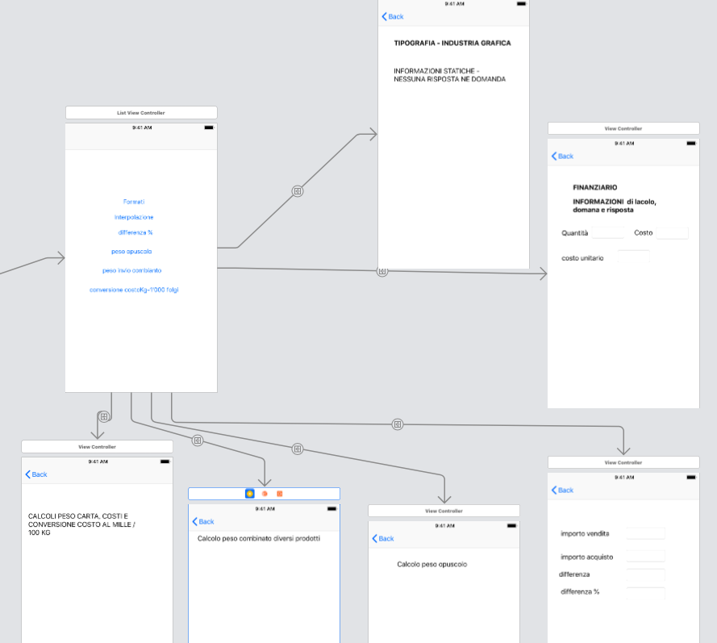
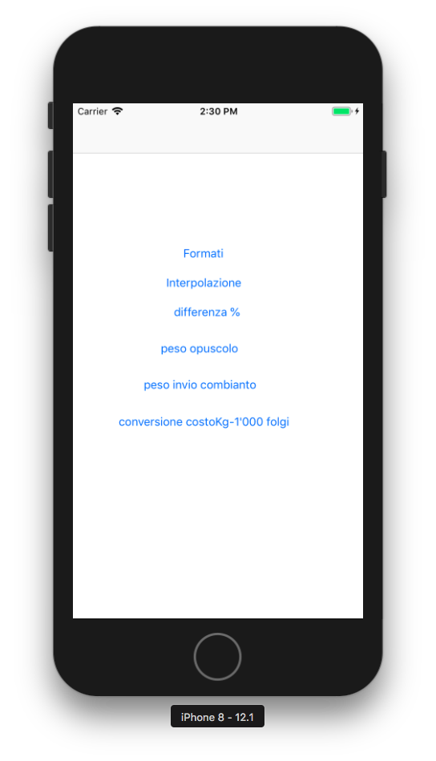
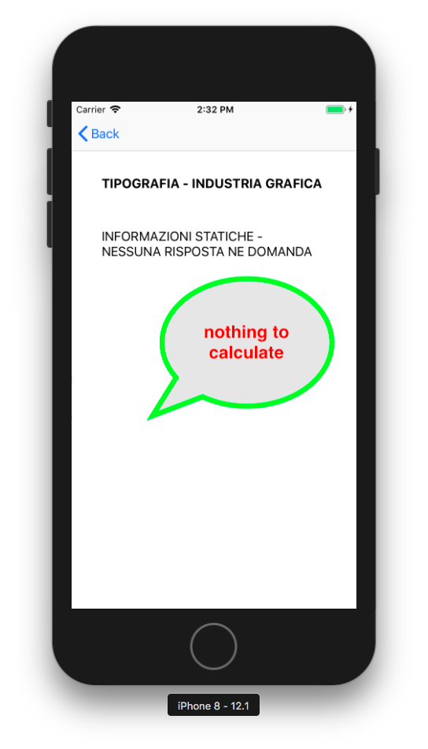

# README

**Calculation Application**

* Flow chart

* Home screen:

* Detail screen

**Things you may want to cover:**

* Swift version 4.0
* Xcode 10.1
* iphone 8

**Requirement**
[Numbers file](files/calcoli diversi per App 2018.numbers)

**References**

http://test.balogh-studiografico.ch/?fbclid=IwAR2z_r8jnGzXL6fY8wBffZaAAh8RD8t3bft141HBQz32qYIe1IKODKbIGDo
